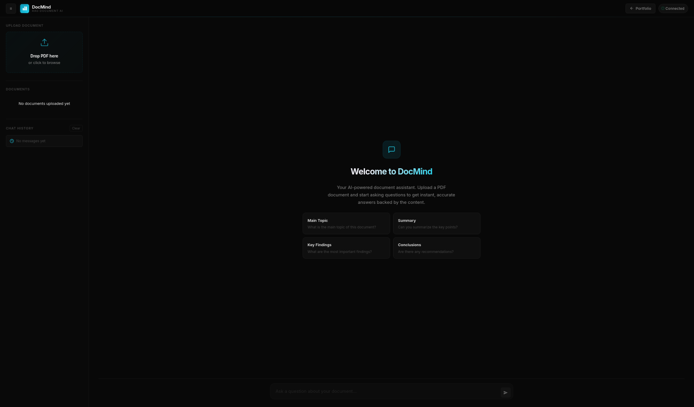
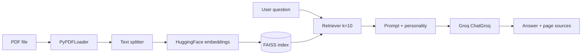

<p align="center">
  
</p>

<p align="center">
  <strong>FastAPI · LangChain · FAISS · Hugging Face Embeddings · Groq</strong><br />
  <em>Retrieval-augmented Q&amp;A over PDFs: chunk, embed, retrieve, and answer with an instruction-tuned LLM.</em>
</p>

<p align="center">
  <a href="https://github.com/sidnei-almeida/rag-document-chatbot"><strong>github.com/sidnei-almeida/rag-document-chatbot</strong></a>
</p>

<p align="center">
  
  
  
</p>

---

## What this repository is

**DocMind** (API title in code: *DocMind API*) is a **RAG (Retrieval-Augmented Generation)** backend for **question answering on PDF documents**. It:

1. **Ingests** PDFs (upload API or offline script), splits them with **`RecursiveCharacterTextSplitter`** (`chunk_size=3500`, `chunk_overlap=400`).
2. **Embeds** chunks with **`sentence-transformers/all-MiniLM-L6-v2`** via **`HuggingFaceEmbeddings`**.
3. **Indexes** vectors in **FAISS** (`faiss_index/` on disk).
4. **Retrieves** the top-**k=10** chunks per question and builds a **prompt** that merges optional **personality** (`AGENT_PERSONALITY.txt`) with page-annotated context.
5. **Generates** answers with **Groq** (`ChatGroq`, default **`llama-3.3-70b-versatile`**).

The service is **Docker-ready** (port **7860**, `uvicorn app:app`) and fits **Hugging Face Spaces**.

---

## Product UI (frontend)

The API is designed to be consumed by any client. The screenshot below shows the **DocMind** web experience (upload, welcome state, suggested prompts) aligned with this backend’s **`/upload`** + **`/ask`** flow.

<p align="center">
  
</p>

<p align="center">
  <sub>Example UI: drag-and-drop PDF, document list, chat — wire these actions to <code>POST /upload</code> and <code>POST /ask</code>.</sub>
</p>

---

## Architecture (logical)



**Runtime guardrails (see `create_prompt` in `main.py`):** small-talk phrases can be answered **without** an index; once a PDF is indexed, the model is steered to **use context** and **not** ask for a new upload when snippets are weak or tangential.

---

## Prerequisites

- **Python 3.11** (matches `Dockerfile`)
- **`GROQ_API_KEY`** — required at startup (the app raises if missing)
- Optional: **CPU PyTorch** for local installs (Dockerfile installs `torch` CPU wheels before other deps)

---

## Local setup

```bash
git clone https://github.com/sidnei-almeida/rag-document-chatbot.git
cd rag-document-chatbot

python -m venv .venv
source .venv/bin/activate   # Windows: .venv\Scripts\activate

# CPU PyTorch first (saves disk; matches Docker pattern)
pip install torch --index-url https://download.pytorch.org/whl/cpu
pip install -r requirements.txt

export GROQ_API_KEY="your_key_here"
```

### Build the index from a file on disk

Place a PDF named **`documento.pdf`** in the project root and run:

```bash
python data_injector.py
```

This writes **`faiss_index/`** (same embedding model the API loads).

### Run the API

```bash
uvicorn app:app --host 0.0.0.0 --port 7860 --reload
```

Or:

```bash
python app.py
```

Open **`http://127.0.0.1:7860/docs`** for Swagger.

---

## HTTP API (summary)

| Method | Path | Purpose |
|--------|------|---------|
| GET | `/` | Status, endpoint list, whether the index is ready. |
| GET | `/health` | Simple health JSON. |
| POST | `/ask` | JSON `{"question": "..."}` → `answer` + `sources` (page numbers when chunks exist). |
| POST | `/upload` | Multipart **PDF**; `replace` query (default **true**) replaces or merges the index. |
| DELETE | `/clear` | Clears the **in-memory** vector store / retriever (see code comments on disk on Spaces). |

**Ask example**

```bash
curl -s -X POST "http://127.0.0.1:7860/ask" \
  -H "Content-Type: application/json" \
  -d '{"question": "What is the main topic of the document?"}'
```

**Typical response shape**

```json
{
  "answer": "...",
  "sources": [1, 2, 3]
}
```

**Rate limiting:** Groq may return **429**; the API surfaces that as HTTP 429 with a message (see `RateLimitError` handling).

---

## Configuration

| Variable / file | Role |
|-----------------|------|
| `GROQ_API_KEY` | **Required** — Groq secret. |
| `GROQ_MODEL` | Optional override in code (default `llama-3.3-70b-versatile`). |
| `VECTOR_STORE_NAME` | Folder for FAISS (default `faiss_index`). |
| `AGENT_PERSONALITY.txt` | System persona / tone for prompts. |

---

## Docker & Hugging Face Spaces

- **`Dockerfile`**: non-root user, installs **CPU torch**, then **`requirements.txt`**, exposes **7860**, runs **`uvicorn app:app`**.  
- **`app.py`** imports **`app`** from **`main`** — the ASGI object lives in **`main.py`**, re-exported for Uvicorn.  
- Set **`GROQ_API_KEY`** as a **secret** on Spaces.  
- Large **`faiss_index`** artifacts may require **Git LFS** if committed.

---

## Repository layout

| Path | Role |
|------|------|
| `main.py` | FastAPI app, lifespan init, RAG logic, `/ask`, `/upload`, `/clear`. |
| `app.py` | Uvicorn entry (`7860`) for local/Spaces. |
| `data_injector.py` | Offline index build from **`documento.pdf`**. |
| `AGENT_PERSONALITY.txt` | Editable assistant persona. |
| `faiss_index/` | Saved FAISS store (`index.faiss`, `index.pkl`, …). |
| `requirements.txt` | Python dependencies. |
| `Dockerfile` / `.dockerignore` | Container build. |
| `images/header.png` | README hero graphic. |
| `images/software.png` | README UI showcase. |

---

## Troubleshooting

| Issue | What to check |
|--------|----------------|
| Startup fails: API key | Export **`GROQ_API_KEY`** before launch. |
| 400 on `/ask` (“No documents indexed…”) | Upload a PDF with **`POST /upload`** or run **`data_injector.py`**. |
| FAISS load errors | Regenerate **`faiss_index`** with the **same** embedding model as production. |
| OOM on small hosts | Smaller Groq model, fewer chunks, or reduce `k` in `search_kwargs`. |

---

## Ethics & disclaimer

Only process PDFs you are **allowed** to index and query. Generated answers may be wrong or incomplete; **verify** critical facts against the source document.

---

## License

MIT — add a `LICENSE` file at the repository root when publishing if not already present.

---

## Author

**Sidnei Almeida** — [@sidnei-almeida](https://github.com/sidnei-almeida)
