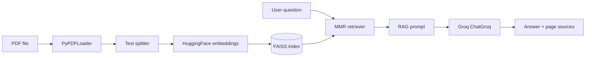

<p align="center">
  
</p>

<p align="center">
  <strong>FastAPI · LangChain · FAISS · Hugging Face Embeddings · Groq</strong><br />
  <em>Retrieval-augmented Q&amp;A over PDFs: chunk, embed, retrieve, and answer with an instruction-tuned LLM.</em>
</p>

<p align="center">
  <a href="https://github.com/sidnei-almeida/rag-document-chatbot"><strong>github.com/sidnei-almeida/rag-document-chatbot</strong></a>
</p>

<p align="center">
  <a href="https://huggingface.co/spaces/salmeida/my-rag-chatbot"></a>
  
  
  
</p>

---

## What this repository is

**DocMind** (API title in code: *DocMind API*) is a **RAG (Retrieval-Augmented Generation)** backend for **question answering on PDF documents**. It:

1. **Ingests** PDFs (upload API or offline script), splits them with **`RecursiveCharacterTextSplitter`** (defaults: `CHUNK_SIZE=1200`, `CHUNK_OVERLAP=180`).
2. **Embeds** chunks with **`sentence-transformers/all-MiniLM-L6-v2`** via **`HuggingFaceEmbeddings`**.
3. **Indexes** vectors in **FAISS** (`faiss_index/` on disk).
4. **Retrieves** chunks with **MMR** (defaults: `k=6`, `fetch_k=20`, `lambda=0.7`) and builds a **RAG prompt** with page-annotated context.
5. **Generates** answers with **Groq** (`ChatGroq`, default **`llama-3.3-70b-versatile`**, `temperature=0.15`).

The service is **Docker-ready** (port **7860**, `uvicorn main:app`) and is deployed on **Hugging Face Spaces**.

**Live demo API:** [salmeida/my-rag-chatbot](https://huggingface.co/spaces/salmeida/my-rag-chatbot) · `https://salmeida-my-rag-chatbot.hf.space`

---

## Product UI (frontend)

The API is designed to be consumed by any client. The screenshot below shows the **DocMind** web experience (upload, welcome state, suggested prompts) aligned with this backend’s **`/upload`** + **`/ask`** flow.

<p align="center">
  
</p>

<p align="center">
  <sub>Example UI: drag-and-drop PDF, document list, chat — wire these actions to <code>POST /upload</code> and <code>POST /ask</code>.</sub>
</p>

---

## Architecture (logical)



**Runtime guardrails (see `create_rag_prompt` in `main.py`):** small-talk phrases can be answered **without** retrieval; document questions use retrieved context only; when no relevant chunks are found, the API returns an honest no-evidence message instead of inventing an answer.

---

## Prerequisites

- **Python 3.11** (matches `Dockerfile`)
- **`GROQ_API_KEY`** — required at startup (the app raises if missing)
- Optional: **CPU PyTorch** for local installs (Dockerfile installs `torch` CPU wheels before other deps)

---

## Local setup

```bash
git clone https://github.com/sidnei-almeida/rag-document-chatbot.git
cd rag-document-chatbot

python -m venv .venv
source .venv/bin/activate   # Windows: .venv\Scripts\activate

# CPU PyTorch first (saves disk; matches Docker pattern)
pip install torch --index-url https://download.pytorch.org/whl/cpu
pip install -r requirements.txt

export GROQ_API_KEY="your_key_here"
```

Copy **`.env.example`** to **`.env`** and adjust optional RAG/LLM settings if needed.

### Build the index from a file on disk

Place a PDF named **`documento.pdf`** in the project root and run:

```bash
python data_injector.py
```

This writes **`faiss_index/`** (same embedding model the API loads).

### Run the API

```bash
uvicorn main:app --host 0.0.0.0 --port 7860 --reload
```

Or:

```bash
python app.py
```

Open **`http://127.0.0.1:7860/docs`** for Swagger.

---

## Running tests

Tests use **pytest** with mocked Groq/LLM and no real API key. Install dev dependencies (included in `requirements.txt`):

```bash
pip install pytest httpx
pytest
```

Optional verbose run:

```bash
pytest -v
```

The suite covers `/health`, `/status`, `/clear`, `/ask`, `/upload` validations, and RAG utility functions. It does not call Groq or download embedding models.

### RAG evaluation (`evals/`)

Simple portfolio eval over the **sample document** — checks retrieved `sources` and keyword overlap (no LangSmith / RAGAS):

```bash
# Retrieval-only, no Groq API key
python evals/run_eval.py --mode local

# Full pipeline against a running API
python evals/run_eval.py --mode api --api-url http://127.0.0.1:7860
```

See **`evals/README.md`** for the `questions.json` schema and options.

---

## HTTP API (workspace RAG)

Each **upload** creates an isolated **workspace** (`workspace_id`). One or more PDFs in the same request share one FAISS index. The next upload creates a **new** workspace — documents never mix.

| Method | Path | Purpose |
|--------|------|---------|
| GET | `/health` | `api_ready`, `documents_ready`, `workspace_count`, limits (OK with zero workspaces). |
| GET | `/workspaces` | List workspaces for the sidebar. |
| GET | `/workspaces/{workspace_id}` | Full workspace metadata + `documents[]`. |
| **POST** | **`/workspaces/upload`** | **Primary upload** — field `files` (1+ PDFs). Returns `workspace_id`, `title`, `documents`, `total_pages`, `total_chunks`, `index_ready`. |
| POST | `/ask` | `{"workspace_id":"...","question":"..."}` → `sources[]` with `document_id`, `filename`, `confidence`, `retrieval_used`, `latency_ms`. |
| DELETE | `/workspaces/{workspace_id}` | Remove workspace, disk index, registry, and cache. |
| DELETE | `/clear` | All workspaces, or `?workspace_id=` for one. |
| POST | `/demo/load-sample` | Demo workspace from bundled sample PDF. |

### Upload (recommended)

```bash
# One PDF
curl -X POST http://localhost:7860/workspaces/upload -F "files=@document.pdf"

# Multiple PDFs → one workspace
curl -X POST http://localhost:7860/workspaces/upload \
  -F "files=@contract.pdf" -F "files=@appendix.pdf"
```

### Ask

```bash
curl -X POST http://localhost:7860/ask \
  -H "Content-Type: application/json" \
  -d '{"workspace_id":"ws_20260530_abc123","question":"What are the payment terms?"}'
```

### Legacy (compatibility)

| Method | Path | Notes |
|--------|------|--------|
| POST | `/upload` | Field `file` — still creates a **new** workspace; prefer `/workspaces/upload`. |
| POST | `/upload/batch` | Deprecated — use `/workspaces/upload` with multiple `files`. |

Manual test checklist: **`TESTING.md`**.

### Try sample document (API)

For portfolio demos, a small PDF ships in **`sample_documents/`** (default: `ai-document-intelligence-report.pdf`). Load it without uploading:

```bash
curl -X POST http://127.0.0.1:7860/demo/load-sample
```

Example response:

```json
{
  "status": "sample_loaded",
  "document": {
    "file_name": "ai-document-intelligence-report.pdf",
    "pages": 7,
    "chunks": 12
  },
  "index_ready": true
}
```

Then ask questions such as: *What is this document about?*, *What are the main benefits?*, *What technologies are used?*

Override path/name with `SAMPLE_DOCUMENTS_DIR` and `SAMPLE_DOCUMENT_FILENAME`. The repo’s **`documents/`** folder is for your own files only; the API does not read it unless you point env vars there.

**Ask example**

```bash
curl -s -X POST "http://127.0.0.1:7860/ask" \
  -H "Content-Type: application/json" \
  -d '{"question": "What is the main topic of the document?"}'
```

**Typical response shape**

```json
{
  "answer": "...",
  "sources": [
    {
      "chunk_id": 0,
      "page": 1,
      "page_index": 0,
      "file_name": "document.pdf",
      "preview": "Excerpt from the retrieved chunk...",
      "score": 0.38
    }
  ],
  "confidence": {
    "label": "medium",
    "reason": "Answer based on 3 retrieved passages."
  },
  "metadata": {
    "model": "llama-3.3-70b-versatile",
    "retrieval_k": 6,
    "chunks_used": 3,
    "embedding_model": "sentence-transformers/all-MiniLM-L6-v2"
  }
}
```

Display **`page`** (1-indexed) in the UI; **`page_index`** is the raw 0-based value from PDF metadata. See **`API_ENDPOINTS.md`** for the full contract.

**Rate limiting:** Groq may return **429**; the API surfaces that as HTTP 429 with a message (see `RateLimitError` handling).

---

## Configuration

| Variable | Default | Role |
|----------|---------|------|
| `GROQ_API_KEY` | — | **Required** — Groq secret. |
| `GROQ_MODEL` | `llama-3.3-70b-versatile` | Groq chat model name. |
| `GROQ_TEMPERATURE` | `0.15` | Lower temperature for faithful RAG answers. |
| `GROQ_MAX_TOKENS` | `1024` | Maximum tokens in LLM responses. |
| `CHUNK_SIZE` | `1200` | Characters per document chunk. |
| `CHUNK_OVERLAP` | `180` | Overlap between consecutive chunks. |
| `RETRIEVAL_K` | `6` | Number of chunks returned by the retriever. |
| `RETRIEVAL_FETCH_K` | `20` | Candidate pool size for MMR selection. |
| `RETRIEVAL_LAMBDA` | `0.7` | MMR diversity vs. relevance trade-off. |
| `MAX_FILE_SIZE_MB` | `20` | Max size per PDF. |
| `MAX_FILES_PER_WORKSPACE` | `5` | Max PDFs per upload/workspace. |
| `MAX_PAGES_PER_FILE` | `40` | Max pages per PDF. |
| `MAX_TOTAL_PAGES` | `100` | Max total pages per workspace. |
| `WORKSPACE_STORAGE_ROOT` | `/tmp/docmind_storage/workspaces` | On-disk workspace layout. |
| `ALLOWED_ORIGINS` | localhost:3000,5173 (default) | CORS for frontend; comma-separated or `*`. |
| `MAX_QUESTION_LENGTH` | `1000` | Max characters per question. |
| `ALLOWED_ORIGINS` | `*` | CORS: `*` or comma-separated origins. |
| `VECTOR_STORE_PATH` | `/tmp/docmind_faiss_index` | Directory containing `index.faiss` (writable on HF Spaces). |
| `AUTO_LOAD_SAMPLE_ON_STARTUP` | `true` | Build index from bundled sample PDF when `index.faiss` is missing. |
| `EMBEDDING_MODEL_NAME` | `all-MiniLM-L6-v2` | Hugging Face embeddings model. |
| `LOG_LEVEL` | `INFO` | Application log level. |

**Public demo limits** exist to keep the Hugging Face Space stable on free-tier CPU/RAM and to avoid abuse. Adjust via env vars for private deployments.

See **`.env.example`** for a copy-paste template.

---

## Deploy no Hugging Face Spaces

Este projeto usa o Space existente **[salmeida/my-rag-chatbot](https://huggingface.co/spaces/salmeida/my-rag-chatbot)** com **Docker SDK** (API FastAPI, não Gradio).

### URLs úteis

| Recurso | URL |
|---------|-----|
| Space (painel) | https://huggingface.co/spaces/salmeida/my-rag-chatbot |
| API base | https://salmeida-my-rag-chatbot.hf.space |
| Swagger | https://salmeida-my-rag-chatbot.hf.space/docs |
| Health | https://salmeida-my-rag-chatbot.hf.space/health |

### O que o Space precisa no repositório

| Arquivo / pasta | Motivo |
|-----------------|--------|
| `Dockerfile` | Build Docker (SDK padrão do Space) |
| `requirements.txt` | Dependências Python |
| `main.py`, `app.py`, `app/` | Código da API |
| `sample_documents/*.pdf` | Demo `POST /demo/load-sample` sem upload |

Não é obrigatório commitar `faiss_index/` — no Space use **`POST /demo/load-sample`** ou upload de PDF.

### Secret obrigatório

No Space: **Settings → Repository secrets**

| Nome | Valor |
|------|--------|
| `GROQ_API_KEY` | Sua chave em https://console.groq.com/ |

Sem essa secret o container sobe mas `/ask` falha ao chamar o LLM.

### Variáveis opcionais (Settings → Variables)

Copie de `.env.example` se quiser ajustar limites da demo: `MAX_FILE_SIZE_MB`, `MAX_PAGES`, `GROQ_MODEL`, `RETRIEVAL_K`, `ALLOWED_ORIGINS`, etc.

### Publicar alterações no Space

```bash
# Uma vez: remote do Space
git remote add hf https://huggingface.co/spaces/salmeida/my-rag-chatbot

# Commit + push (token HF com permissão Write)
git push hf main
```

Ou use o script:

```bash
bash deploy_to_hf.sh
```

Guia detalhado: **[DEPLOY_INSTRUCTIONS.md](./DEPLOY_INSTRUCTIONS.md)**

### Testar a API no Space

```bash
BASE=https://salmeida-my-rag-chatbot.hf.space

curl -s "$BASE/health" | jq .

# Documento de demonstração (recomendado após cada restart)
curl -X POST "$BASE/demo/load-sample"

curl -X POST "$BASE/ask" \
  -H "Content-Type: application/json" \
  -d '{"question": "What are the main benefits?"}'
```

**Nota:** a primeira requisição após o build pode demorar (download do modelo de embeddings na CPU). O Space gratuito tem limites de RAM — por isso existem `MAX_FILE_SIZE_MB` e `MAX_PAGES`.

### Docker local (mesma imagem do Space)

```bash
docker build -t docmind-api .
docker run --rm -p 7860:7860 -e GROQ_API_KEY="sua_chave" docmind-api
```

---

## Docker (resumo técnico)

- **`Dockerfile`**: usuário não-root, **PyTorch CPU**, `requirements.txt`, porta **`PORT`** (default `7860`), `uvicorn main:app`.
- **`app.py`**: reexporta `app` de `app.main` para compatibilidade.
- **`.dockerignore`**: exclui `tests/`, `documents/`, `faiss_index/` local — inclui `sample_documents/`.

---

## Repository layout

| Path | Role |
|------|------|
| `app/main.py` | FastAPI factory, CORS, lifespan, exception handlers. |
| `app/core/config.py` | Centralized environment settings. |
| `app/api/routes.py` | HTTP routes (`/ask`, `/upload`, `/demo/load-sample`, `/health`, `/status`, `/clear`). |
| `sample_documents/` | PDF de demo para `POST /demo/load-sample`. |
| `evals/` | Avaliação RAG simples (`questions.json`, `run_eval.py`). |
| `deploy_to_hf.sh` | Helper para push ao Space HF. |
| `DEPLOY_INSTRUCTIONS.md` | Guia de deploy no Hugging Face. |
| `app/services/` | Ingestion, retrieval, bootstrap, status helpers. |
| `app.py` / `main.py` | Uvicorn entrypoints (`7860`) for Spaces. |
| `data_injector.py` | Offline index build from **`documento.pdf`**. |
| `faiss_index/` | Saved FAISS store (`index.faiss`, `index.pkl`, …). |
| `requirements.txt` | Python dependencies. |
| `Dockerfile` / `.dockerignore` | Container build. |
| `images/header.png` | README hero graphic. |
| `images/software.png` | README UI showcase. |

---

## Troubleshooting

| Issue | What to check |
|--------|----------------|
| Startup fails: API key | Export **`GROQ_API_KEY`** before launch. |
| 400 on `/ask` (“No documents indexed…”) | **`POST /demo/load-sample`** or **`POST /upload`**. |
| HF Space lento na 1ª pergunta | Cold start + download embeddings; aguarde ~1–2 min. |
| HF build OOM | Reduza `RETRIEVAL_K` / `CHUNK_SIZE` ou use Space com mais RAM. |
| FAISS load errors | Regenerate **`faiss_index`** with the **same** embedding model as production. |
| OOM on small hosts | Smaller Groq model, fewer chunks, or reduce `RETRIEVAL_K`. |

---

## Ethics & disclaimer

Only process PDFs you are **allowed** to index and query. Generated answers may be wrong or incomplete; **verify** critical facts against the source document.

---

## License

MIT — add a `LICENSE` file at the repository root when publishing if not already present.

---

## Author

**Sidnei Almeida** — [@sidnei-almeida](https://github.com/sidnei-almeida)
